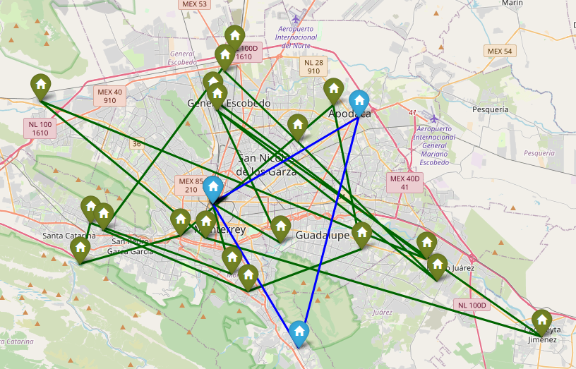

# Capacitated Vehicle Routing Problem

- [Capacitated Vehicle Routing Problem](#capacitated-vehicle-routing-problem)
  - [Databases](#databases)
  - [Data cleaning](#data-cleaning)
    - [Geo-coding addresses](#geo-coding-addresses)
  - [Solving the VRP](#solving-the-vrp)
  - [Results](#results)
  - [Installation and usage](#installation-and-usage)
  - [Credits](#credits)
  - [License](#license)

## Databases

For this project we received 4 different datasets. Here is a small overview of the information contained in these files:

- Assets to be delivered: Excel file with every purchase made on the company's website
- Types of vehicles that can be used:
  - Name of the model
  - Gasoline consumption
  - Maximum load capacity
- Product catalog:
  - Product category
  - Name of the product
  - Code
  - Volume
- Distribution Centers' locations (For this project we have focused solely in Monterrey)
  - Name of the distribution center
  - Location, both address and coordinates

## Data cleaning

[(Back to top)](#table-of-contents)

For the purposes of working with these databases we adopted the common library [pandas](https://pandas.pydata.org/). Some data cleaning and text processing was performed across the datasets, such as:

- Keep only the latest deliveries (we only need the latest purchases)
- Removal of missing values
- Renaming city names to math the real names of the cities
- Generation of a full address from the reference data included
- Determined how much volume must be sent to a particular client through pandas merge method.

### Geo-coding addresses

[(Back to top)](#table-of-contents)

After completing the cleaning stage, we have a single dataset containing all the addresses and products to be delivered to the clients. We then need a way to measure the distance between each client for the purposes of calculating the distance matrix needed to solve a CVRP. We used the geocoder `Photon` through the API made by `geopy` to obtain a list of coordinates for each address. After the geocoding process of a single address, a new column containing latitude, longitude and altitude is generated.

Some serious caveats of this approach is the lack of reliability for the geocoding process, after several attempts and different proposal for addresses, we were only able to geo-code at most 26% of the addresses that remained from the last stage.

> It might be the case that a commercial license has a lowe rate of failure, Google's API is the most logical option given we use it's API for the next stage.

## Solving the VRP

[(Back to top)](#table-of-contents)

Solving a VRP instance requires that we first determine it's nature:

- Do we have volume constraints?
- Is there a limit to how much time the vehicle can spend on the route?
- What about the distance it travels, is there a limit to it?
- A mix of all the examples above.

For this repo we have focused on finding optimal solutions for the capacitated vehicle routing problem. You can find the formal mathematical model we have proposed for solving the problem in the folder `reports`.

Now, to actually solve the CVRP, we followed the guide provided by Google [here](https://developers.google.com/optimization/routing/cvrp). We first calculated the distance matrix using the `cdist` function of `scipy.spatial.distance`, for a more realistic measure we used the geodesic distance.

## Results

[(Back to top)](#table-of-contents)

As of now, the project is focused on solving a CVRP with 9 vehicles and a maximum load capacity of 18 cubic meters each. Using the library `folium` we generated a map that displays the 9 different routes taken by the vehicles, here's an example of the generated html file:

|  |
|:--:|
| *Example of 2 optimal routes found* |

## Installation and usage

[(Back to top)](#table-of-contents)

This repo was designed and tested with Python 3.8 running on Ubuntu based on WSL2.

1. Clone the repository to the location of your choosing:
    - `git clone https://github.com/JuanEcheagaray75/coppel-vrp-tsp.git`
2. I recommend creating a virtual environment for this project, but feel free to skip this step>
    - `python3 -m venv .venv`
3. Activate the virtual environment:
    - `source .venv/bin/activate`
4. Install the dependencies:
    - `pip install -r requirements.txt`
5. Run bash script:
    - `source run.sh`

## Credits

We would like to thank:

- Professor Fernando Elizalde Ramírez: for his advice on the overall implementation and modeling of the CVRP
- Professor Jaime Eduardo Martínez Sánchez: for his advice on the interpretation and validation of the optimal routes found
- Google's ortools library: for the implementation of the CVRP solver and the great documentation

## License

[(Back to top)](#table-of-contents)

[GNU General Public License version 3](https://opensource.org/licenses/GPL-3.0)
